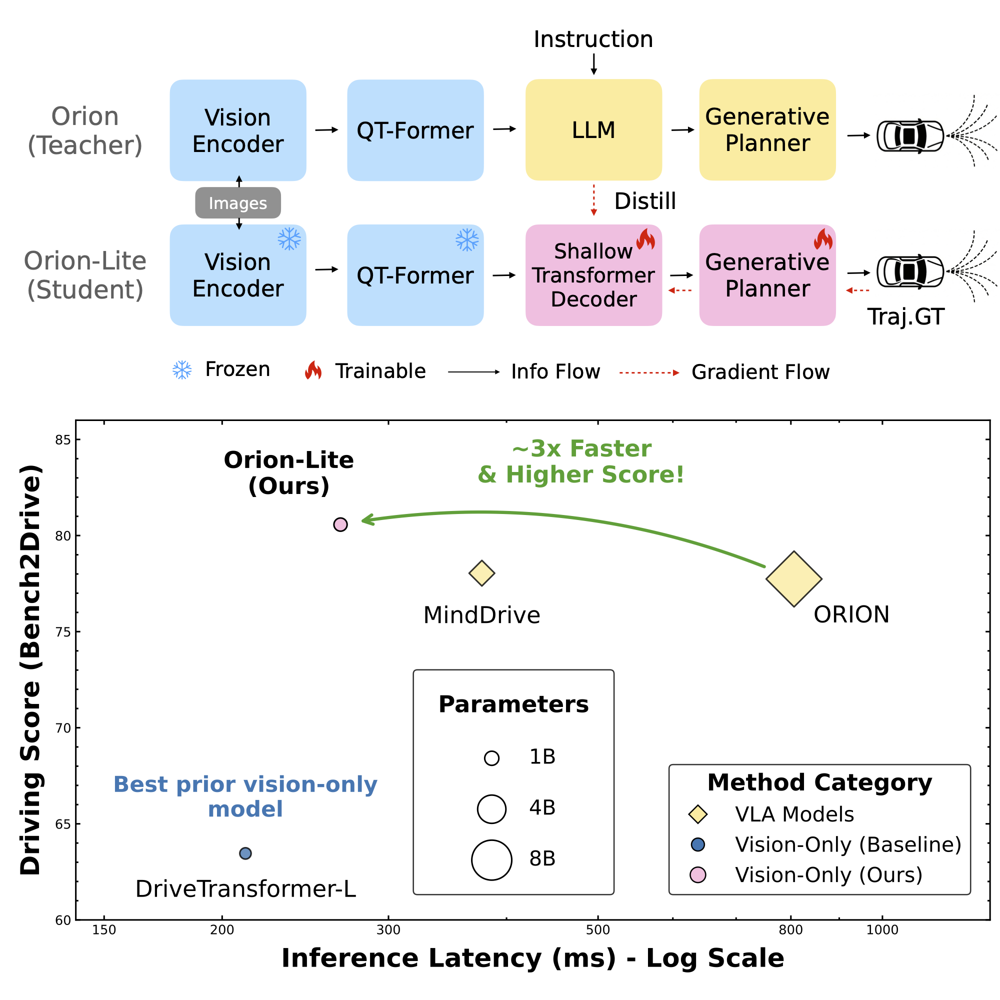

<!-- # Orion-Lite: Distilling LLM Reasoning into Efficient Vision-Only Driving Models -->

<div align="center">
<h3>[CVPRW 26] Orion-Lite: Distilling LLM Reasoning into Efficient Vision-Only Driving Models</h3>
Jing Gu, Cavagnero, Niccolò, Dubbelman, Gijs<sup>†</sup>

Eindhoven University of Technology, MPS Lab

(†) Team leader.
</div>

## Abstract

Leveraging the general world knowledge of Large Language Models (LLMs) holds significant promise for improving the ability of autonomous driving systems to handle rare and complex scenarios. While integrating LLMs into Vision-Language-Action (VLA) models has yielded state-of-the-art performance, their massive parameter counts pose severe challenges for latency-sensitive and energy-efficient deployment. Distilling LLM knowledge into a compact driving model offers a compelling solution to retain these reasoning capabilities while maintaining a manageable computational footprint. Although previous works have demonstrated the efficacy of distillation, these efforts have primarily focused on relatively simple scenarios and open-loop evaluations. Therefore, in this work, we investigate LLM distillation in more complex, interactive scenarios under closed-loop evaluation. We demonstrate that through a combination of latent feature distillation and ground-truth trajectory supervision, an efficient vision-only student model \textbf{Orion-Lite} can even surpass the performance of its massive VLA teacher, ORION. Setting a new state-of-the-art on the rigorous Bench2Drive benchmark, with a Driving Score of 80.6. Ultimately, this reveals that vision-only architectures still possess significant, untapped potential for high-performance reactive planning.

## Overview

<p align="center">
  <a href="assets/figures/paper_figs.pdf">
    
  </a>
</p>

The student decoder takes teacher visual queries as input and predicts the ego planning feature directly, bypassing the expensive LLM forward pass at inference time. The repo supports distilled training, fused checkpoint export, and Bench2Drive-compatible evaluation.

## Links

- Paper: [Orion-Lite](https://arxiv.org/pdf/2604.08266v1)
- Lab page: [MPS-LAB](https://www.tue-mps.org/)
- Checkpoints: [HuggingFace](https://huggingface.co/JG-GJ/Orion-Lite/tree/main/fused_ckpts)
- Evaluation JSON: Orion-Lite/eval/eval_results

## Currently Supported Features

- [√] Teacher distillation-data collection to `.npz`
- [√] Student decoder training with regression-only losses
- [√] Student training with Orion planning, boundary, collision, and feature-mimic losses
- [√] Fused checkpoint export for public evaluation
- [√] Open-loop evaluation
- [√] Closed-loop Bench2Drive evaluation

## Getting Started

```bash
git clone https://github.com/tue-mps/Orion-Lite.git
cd Orion-Lite
conda create -n orion-lite python=3.8 -y
conda activate orion-lite

# Pick the PyTorch build that matches your CUDA setup.
# CUDA 11.8
pip install torch==2.4.1+cu118 torchvision==0.19.1+cu118 torchaudio==2.4.1 --index-url https://download.pytorch.org/whl/cu118

# CUDA 12.4
# pip install torch==2.5.1+cu124 torchvision==0.20.1+cu124 torchaudio==2.5.1 --index-url https://download.pytorch.org/whl/cu124

pip install -v -e .
pip install -r requirements.txt
```

## Distillation Data Collection

Orion-Lite provides a dedicated collection pipeline in [data_collection/README.md](data_collection/README.md). The collection path uses `OrionCollect`, so you do not need to patch `orion.py` manually.

Collect the full training and validation splits:

```bash
bash data_collection/collect_distill_data.sh all
```

Useful environment variables:

```bash
ORION_CKPT=/path/to/Orion.pth
DATA_ROOT=/path/to/bench2drive
INFO_ROOT=/path/to/infos
OUT_DIR=/path/to/distill_data
GPU=0
NUM_WORKERS=4
```

Each frame is saved as a compressed `.npz` file containing the visual queries, teacher planning token, and planning supervision used during student training.

## Train

### Full Training with Orion Planning Losses

Train `OrionMimicModel` with planning regulation, boundary, collision, and optional feature-mimic losses:

```bash
cd distill
python train_student_with_orion_loss.py \
    --train-dir ../distill_data/train \
    --val-dir ../distill_data/val \
    --orion-ckpt ../ckpts/Orion.pth \
    --use-feature-mimic-loss \
    --epochs 20 \
    --run-name orion_student_with_mimic_loss
```

The distilled run is written under `distill/runs/<run_name>/`.

## Evaluation

The public evaluation flow uses only:

- one distilled run `config.json` from `distill/results/`
- one fused checkpoint from `eval/fused_ckpts/`

For the main Orion-Lite model, use:

- `distill/results/orion_student_with_mimic_loss/config.json`
- `eval/fused_ckpts/orion_lite.pth`

### Open-Loop Evaluation

```bash
python eval/scripts/evaluate_fused_checkpoint.py \
    --task openloop \
    --config-json distill/results/orion_student_with_mimic_loss/config.json \
    --fused-ckpt eval/fused_ckpts/orion_lite.pth \
    --gpus 4 \
    --base-port 29513
```

`--data-root`, `--info-root`, and `--log-root` can be used to override defaults when needed.

### Closed-Loop Evaluation

Full Bench2Drive220 evaluation:

```bash
python eval/scripts/evaluate_fused_checkpoint.py \
    --task closedloop \
    --config-json distill/results/orion_student_with_mimic_loss/config.json \
    --fused-ckpt eval/fused_ckpts/orion_lite.pth \
    --mode full
```

## Results and Checkpoints

### Main Bench2Drive220 Summary

| Model | Closed-loop DS | Closed-loop SR | Efficiency | Comfortness | Open-loop Avg. L2 | Latency | Checkpoint | Eval JSON |
| :--- | ---: | ---: | ---: | ---: | ---: | ---: | :--- | :--- |
| ORION (0.5B) | 72.9 | 45.8 | - | - | - | - |  |  |
| ORION (7B Teacher) | 77.7 | 54.6 | 151.5 | 17.4 | 0.68 | 806 ms | [ORION](https://github.com/xiaomi-mlab/Orion) |  |
| Orion-Lite (0.1B) | **80.6** | **55.5** | **157.7** | 10.3 | 0.79 | **267 ms** | [Orion-Lite](https://huggingface.co/JG-GJ/Orion-Lite/tree/main/fused_ckpts) | [eval_results](eval/eval_results) |

Compared with the 7B teacher, Orion-Lite improves Driving Score by `+2.9`, Success Rate by `+0.9`.

## Citation

```bibtex
@article{gu2026orion,
  title={Orion-Lite: Distilling LLM Reasoning into Efficient Vision-Only Driving Models},
  author={Gu, Jing and Cavagnero, Niccol{\`o} and Dubbelman, Gijs},
  journal={arXiv preprint arXiv:2604.08266},
  year={2026}
}
```
